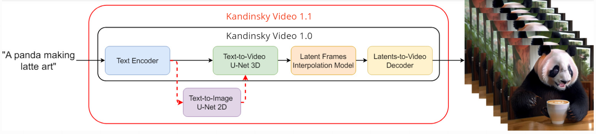
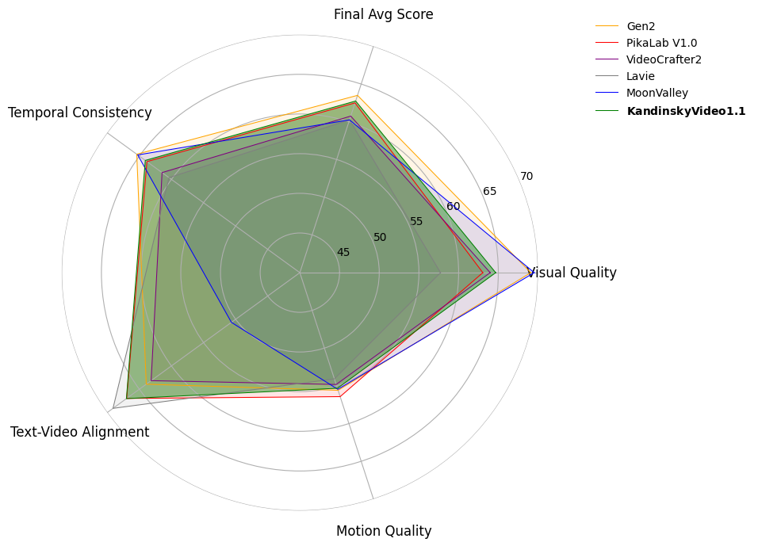

# Kandinsky Video 1.1 — a new text-to-video generation model 
## SoTA quality among open-source solutions on <a href="https://evalcrafter.github.io/">EvalCrafter</a> benchmark

This repository is the official implementation of Kandinsky Video 1.1 model.

[](https://huggingface.co/ai-forever/KandinskyVideo_1_1) | [Telegram-bot](https://t.me/) | [Habr post](https://habr.com/ru/companies/sberbank/articles/817667/) | [Our text-to-image model](https://github.com/ai-forever/Kandinsky-3/tree/main) | [Project page](https://ai-forever.github.io/KandinskyVideo/K11/)

<p>
<!--  -->
<!-- <br> -->
Our <B>previous</B> model <a href="https://github.com/ai-forever/KandinskyVideo/tree/kandinsky_video_1_0">Kandinsky Video 1.0</a>, divides the video generation process into two stages: initially generating keyframes at a low FPS and then creating interpolated frames between these keyframes to increase the FPS. In <B>Kandinsky Video 1.1</B>, we further break down the keyframe generation into two extra steps: first, generating the initial frame of the video from the textual prompt using Text to Image <a href="https://github.com/ai-forever/Kandinsky-3">Kandinsky 3.0</a>, and then generating the subsequent keyframes based on the textual prompt and the previously generated first frame. This approach ensures more consistent content across the frames and significantly enhances the overall video quality. Furthermore, the approach allows animating any input image as an additional feature.
</p>


## Pipeline

<p align="center">

<br>
<em>In the <a href="https://github.com/ai-forever/KandinskyVideo/tree/kandinsky_video_1_0">Kandinsky Video 1.0</a>, the encoded text prompt enters the text-to-video U-Net3D keyframe generation model with temporal layers or blocks, and then the sampled latent keyframes are sent to the latent interpolation model to predict three interpolation frames between
two keyframes. An image MoVQ-GAN decoder is used to obtain the final video result. In <B>Kandinsky Video 1.1</B>, text-to-video U-Net3D is also conditioned on text-to-image U-Net2D, which helps to improve the content quality. A temporal MoVQ-GAN decoder is used to decode the final video.</em>
</p>


**Architecture details**

+ Text encoder (Flan-UL2) - 8.6B
+ Latent Diffusion U-Net3D - 4.15B
+ The interpolation model (Latent Diffusion U-Net3D) - 4.0B 
+ Image MoVQ encoder/decoder - 256M
+ Video (temporal) MoVQ decoder - 556M

## How to use

<!--Check our jupyter notebooks with examples in `./examples` folder -->

### 1. text2video

```python
from kandinsky_video import get_T2V_pipeline

device_map = 'cuda:0'
t2v_pipe = get_T2V_pipeline(device_map)

prompt = "A cat wearing sunglasses and working as a lifeguard at a pool."

fps = 'medium' # ['low', 'medium', 'high']
motion = 'high' # ['low', 'medium', 'high']

video = t2v_pipe(
    prompt,
    width=512, height=512, 
    fps=fps, 
    motion=motion,
    key_frame_guidance_scale=5.0,
    guidance_weight_prompt=5.0,
    guidance_weight_image=3.0,
)

path_to_save = f'./__assets__/video.gif'
video[0].save(
    path_to_save,
    save_all=True, append_images=video[1:], duration=int(5500/len(video)), loop=0
)
```

<p align="center">
    
    <br><em>Generated video</em>
</p>

### 2. image2video

```python
from kandinsky_video import get_T2V_pipeline

device_map = 'cuda:0'
t2v_pipe = get_T2V_pipeline(device_map)

from PIL import Image
import requests
from io import BytesIO

url = 'https://media.cnn.com/api/v1/images/stellar/prod/gettyimages-1961294831.jpg'
response = requests.get(url)
img = Image.open(BytesIO(response.content))
img.show()

prompt = "A panda climbs up a tree."

fps = 'medium' # ['low', 'medium', 'high']
motion = 'medium' # ['low', 'medium', 'high']

video = t2v_pipe(
    prompt,
    image=img,
    width=640, height=384, 
    fps=fps, 
    motion=motion,
    key_frame_guidance_scale=5.0,
    guidance_weight_prompt=5.0,
    guidance_weight_image=3.0,
)

path_to_save = f'./__assets__/video2.gif'
video[0].save(
    path_to_save,
    save_all=True, append_images=video[1:], duration=int(5500/len(video)), loop=0
)
```

<p align="center">
<br>
<em>Input image.</em>
</p>

<p align="center">
<br>
<em>Generated Video.</em>
</p>

## Motion score and Noise Augmentation conditioning

<p align="center">
<br>
<em>Variations in generations based on different motion scores and noise augmentation levels. The horizontal axis shows noise augmentation levels (NA), while the vertical axis displays motion scores (MS).</em>
</p>

##  Results

<p align="center">

<br>    
<em> Kandinsky Video 1.1 achieves second place overall and best open source model on <a href="https://evalcrafter.github.io/">EvalCrafter</a> text to video benchmark. VQ: visual quality, TVA: text-video alignment, MQ: motion quality, TC: temporal consistency and FAS: final average score.
</em>
</p>

<p align="center">

<br>
<em> Polygon-radar chart representing the performance of Kandinsky Video 1.1 on <a href="https://evalcrafter.github.io/">EvalCrafter</a> benchmark.
</em>
</p>

<p align="center">

<br>
<em> Human evaluation study results. The bars in the plot correspond to the percentage of “wins” in the side-by-side comparison of model generations. We compare our model with <a href="https://arxiv.org/abs/2304.08818">Video LDM</a>.
</em>
</p>

# Authors

+ Zein Shaheen: [Github](https://github.com/zeinsh), [Google Scholar](https://scholar.google.ru/citations?user=bxlgMxMAAAAJ&hl=en)
+ Vladimir Arkhipkin: [Github](https://github.com/oriBetelgeuse), [Google Scholar](https://scholar.google.com/citations?user=D-Ko0oAAAAAJ&hl=ru)
+ Viacheslav Vasilev: [Github](https://github.com/vivasilev), [Google Scholar](https://scholar.google.com/citations?user=redAz-kAAAAJ&hl=ru&oi=sra)
+ Igor Pavlov: [Github](https://github.com/boomb0om)
+ Elizaveta Dakhova: [Github](https://github.com/LizaDakhova)
+ Anastasia Lysenko: [Github](https://github.com/LysenkoAnastasia)
+ Sergey Markov
+ Denis Dimitrov: [Github](https://github.com/denndimitrov), [Google Scholar](https://scholar.google.com/citations?user=3JSIJpYAAAAJ&hl=ru&oi=ao)
+ Andrey Kuznetsov: [Github](https://github.com/kuznetsoffandrey), [Google Scholar](https://scholar.google.com/citations?user=q0lIfCEAAAAJ&hl=ru)


## BibTeX
If you use our work in your research, please cite our publication:
```
@article{arkhipkin2023fusionframes,
  title     = {FusionFrames: Efficient Architectural Aspects for Text-to-Video Generation Pipeline},
  author    = {Arkhipkin, Vladimir and Shaheen, Zein and Vasilev, Viacheslav and Dakhova, Elizaveta and Kuznetsov, Andrey and Dimitrov, Denis},
  journal   = {arXiv preprint arXiv:2311.13073},
  year      = {2023}, 
}
```
